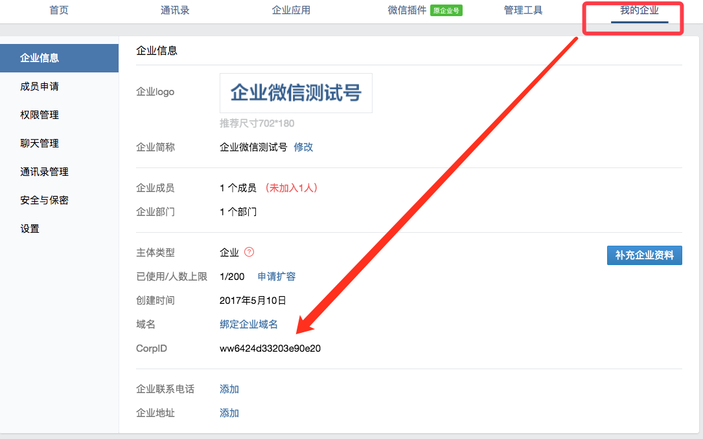
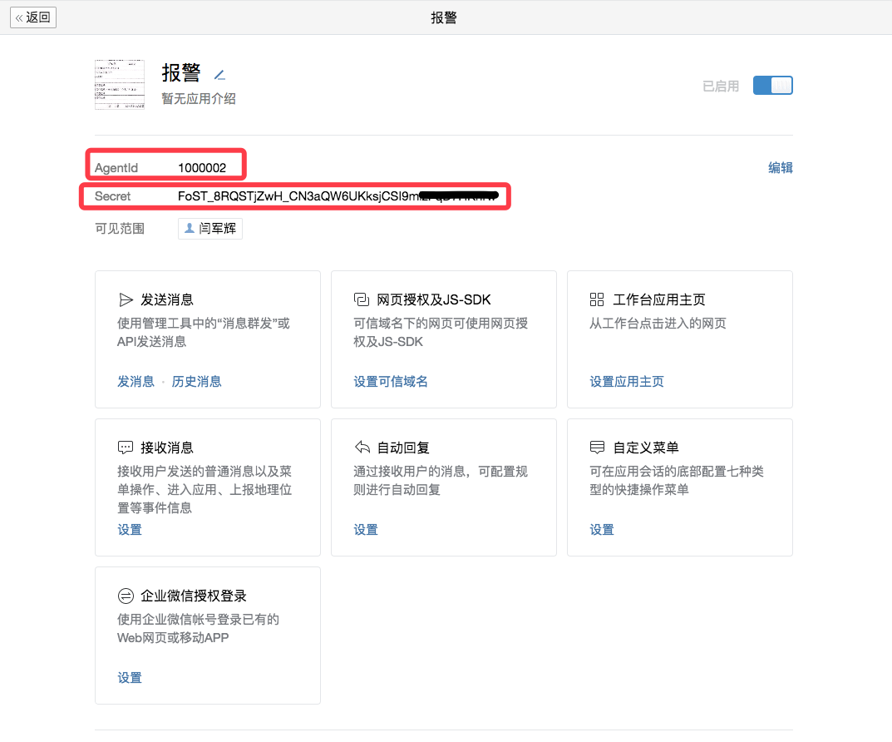
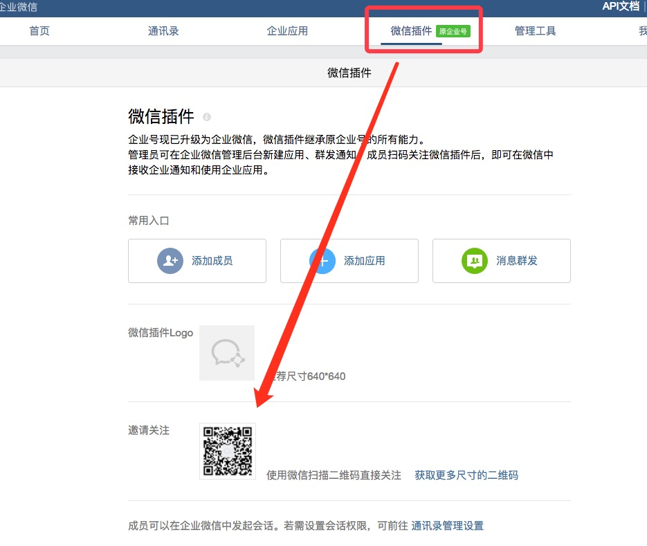

# 企业微信号


---

## 一.申请企业号

1. 以个人邮箱申请就可以, 不通过企业认证的话,有200人的限制,一般足够用了

## 二.获取对接权限
1. 获取corpid

  * 登录后,我的企业 ----> 企业信息  --> CorpID
    
  * 将 CorpID 配置到配置文件 config.conf 内 的 CorpID
    
   
    
    
2. 开启回调模式获取key

   * 登录后,顶部菜单[企业应用] ----> 添加应用
    
   * 进入新添加的应用
    
   * 拿到 AgentId 和 Secret
    
    
    
    
3. 使用微信关注企业号才可以从微信收到信息,否则只能从微信企业号 APP 中收到信息
	
	

## 完成以上步骤后, 即可使用OpenFalcon发送信息,发送格式与 sender 符合:

    tos     微信用户名
    content 信息内容
    

## OpenFalcon+ 配置:

### 在falcon+的 im 配置, 注意是微信企业号内的用户名称, 而不是用户个人的个人微信号


修改配置文件 https://github.com/open-falcon/falcon-plus/blob/master/modules/alarm/cfg.example.json#L25

```
"api": {
	"im": "http://yanjunhui.com:4567/send",
        "sms": "http://127.0.0.1:10086/sms",
        "mail": "http://127.0.0.1:10086/mail",
        "dashboard": "http://127.0.0.1:8081",
        "plus_api":"http://127.0.0.1:8080",
        "plus_api_token": "used-by-alarm-in-server-side-and-disabled-by-set-to-blank"
    },
```

### 使用
> 1. clone 文件 `git clone https://www.github.com/yanjunhui/chat.git`
> 2. 打开目录 `cd chat`
> 3. 启动 `./control.sh start`
> 4. 停止 `./control.sh stop`
> 5. 重启 `./control.sh restart`
> 6. 状态 `./control.sh status`


